<p align="center">
  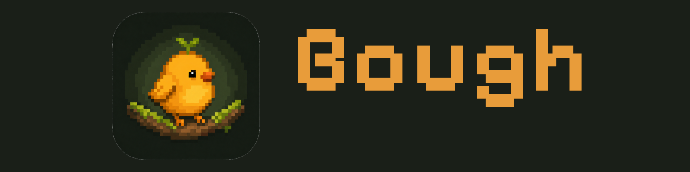
</p>

# Bough

<p align="center">
  <a href="README.md">English</a>
</p>

<p align="center">
  <a href="https://github.com/DGPisces/bough/actions/workflows/ci.yml"></a>
  <a href="LICENSE"></a>
  
</p>

Bough 是一款 macOS 菜单栏工具，专门把 AI 编程助手的状态、用量、音乐和 AirDrop 这些信息常驻在屏幕顶部。

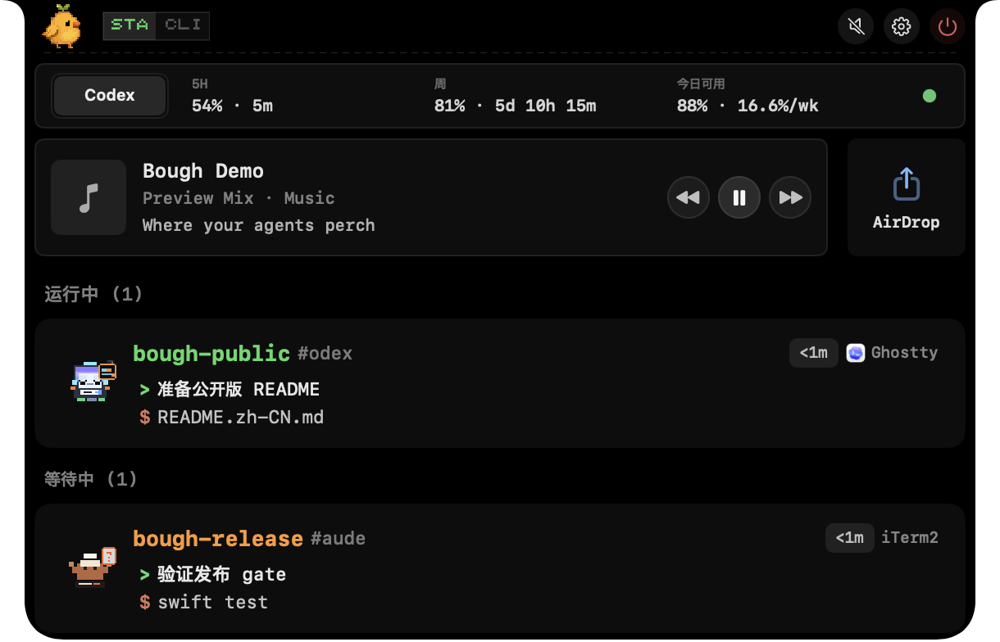

## 功能

- 在 Mac 刘海 / 菜单栏区域实时显示 Codex、Claude Code、Cursor 等工具的会话状态。
- 权限请求、提问、完成、忙碌、空闲——各种状态一目了然，点一下还能切回对应的终端或编辑器窗口。
- 自动跟踪 Codex 和 Claude Code 的每日用量，快到限额的时候提醒你，冷却结束了也会告诉你。
- 正在播放的音乐、歌词，直接挂在菜单栏上，不用切窗口。
- AirDrop 拖拽面板，接收文件更快。
- 不管你在本地开发、SSH 到远程，还是用各种终端和编辑器，都能正常工作。

<details>
<summary>支持的工具</summary>

| 工具 | Bough 吉祥物 |
|---|---|
| Codex |  |
| Claude Code |  |
| Cursor |  |
| GitHub Copilot | 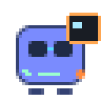 |
| Gemini CLI |  |
| OpenCode | 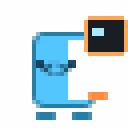 |
| Qwen Code | 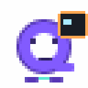 |
| Kimi | 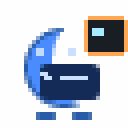 |
| Trae | 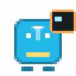 |
| Qoder |  |
| Antigravity | 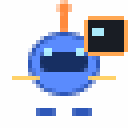 |
| CodeBuddy | 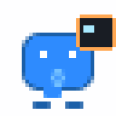 |
| WorkBuddy | 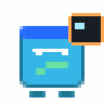 |
| Droid | 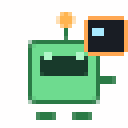 |
| Hermes | 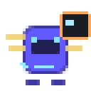 |
| StepFun | 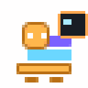 |

</details>

## 安装

### Homebrew Cask

```sh
brew tap DGPisces/tap
brew install --cask bough
```

### GitHub Releases DMG

1. 打开 [GitHub Releases](https://github.com/DGPisces/bough/releases)。
2. 下载最新的版本化 Bough DMG 资产，例如 `Bough-vX.Y.Z.dmg`。
3. 打开 DMG，把 `Bough.app` 拖进 `/Applications`。
4. 首次启动时跟着 macOS 提示走，完成安全确认和权限授权就行。

## 自动更新

- Homebrew Cask 安装的，交给 Homebrew：

  ```sh
  brew update
  brew upgrade --cask bough
  ```

- DMG 安装的，Bough 内置了自动更新。稳定版会走公开 stable channel 检查签名更新。

## 从源码构建

需要 macOS 14+、Swift 5.9+ 和 Xcode Command Line Tools。

```sh
swift package resolve
swift build -c release
swift test
```

构建产物在 `.build/release/Bough`。

## 贡献

贡献流程见 [`CONTRIBUTING.md`](CONTRIBUTING.md)。安全漏洞请通过 GitHub 的 private vulnerability reporting 提交。

## 致谢

Bough 是 [CodeIsland](https://github.com/wxtsky/CodeIsland) 的 fork，感谢原项目打下的基础。许可与第三方说明见 [`CREDITS.md`](CREDITS.md)。

## 许可

Bough 使用 MIT License。详见 [`LICENSE`](LICENSE)。
